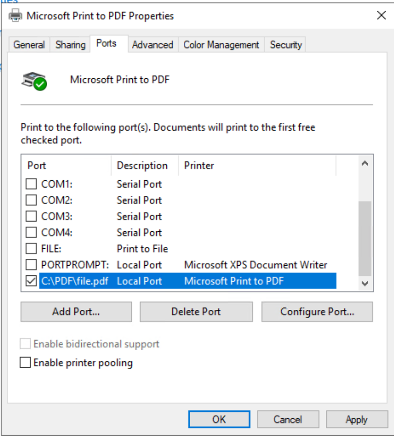

# FAQ

## Microsoft Print to PDF printer issue

### Scenario

Printing issues when Microsoft Print to PDF printer is assigned to CT Label Printer as a physical device. E.g., Request sticks on Processing status.

### Root Cause

Microsoft Print to PDF requires an output path defined as a port.

### Resolution

A port as a path must be defined. You can configure it as mentioned below:

1. Go to Printer & Scanners.

2. Find Microsoft Print to PDF, right click and select Print Properties.

3. Define the new port under the Ports tab as shared below:

    a. Local Port.

    b. New Port.

    c. Port Name: \{path\}\file.pdf.

    d. Apply.

    
