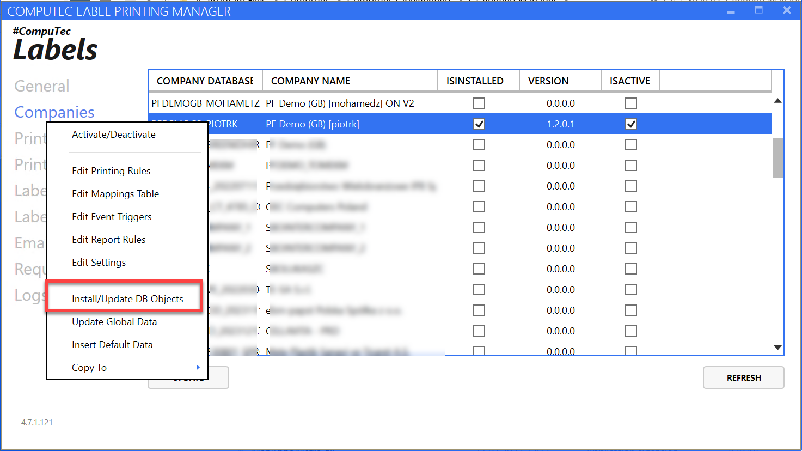
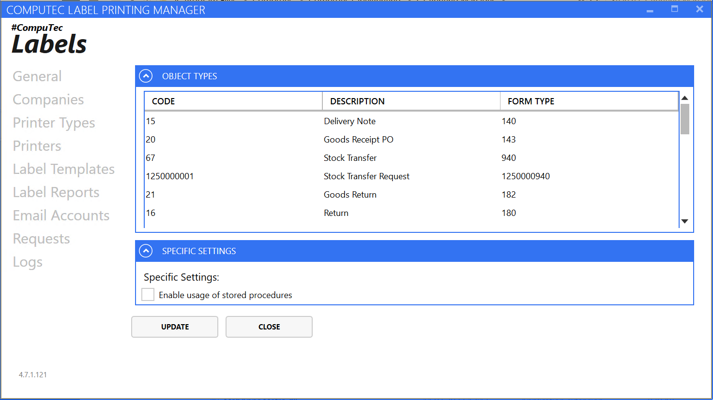
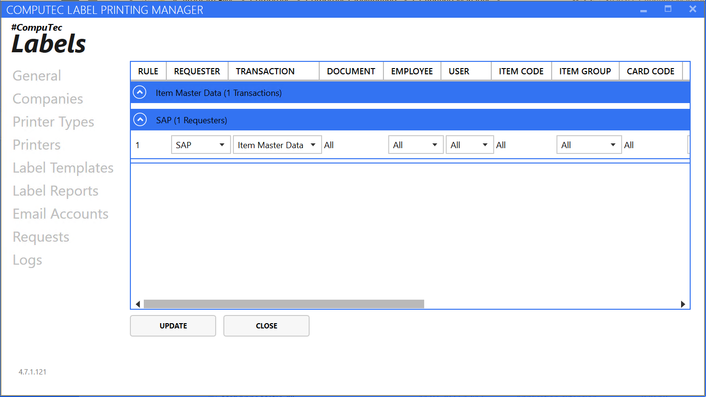
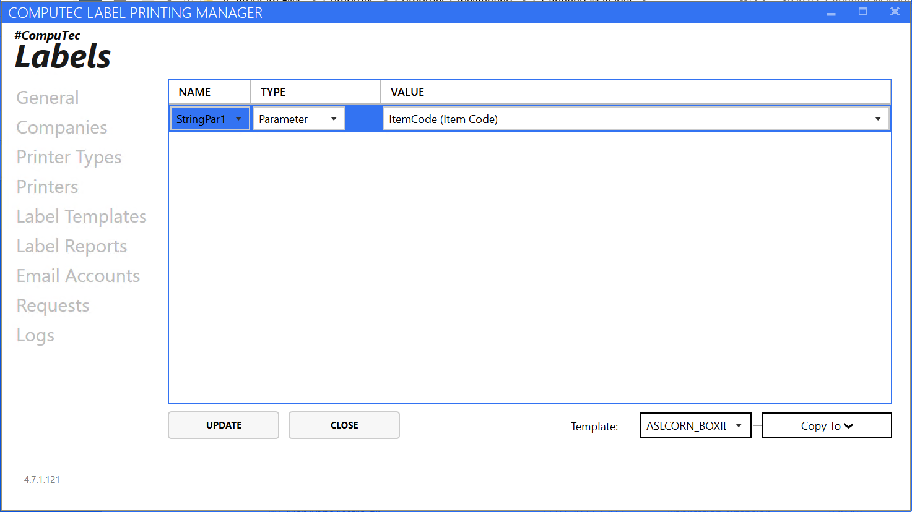
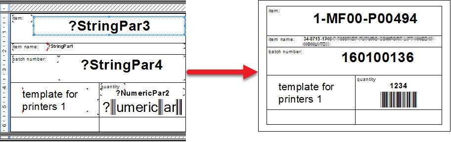
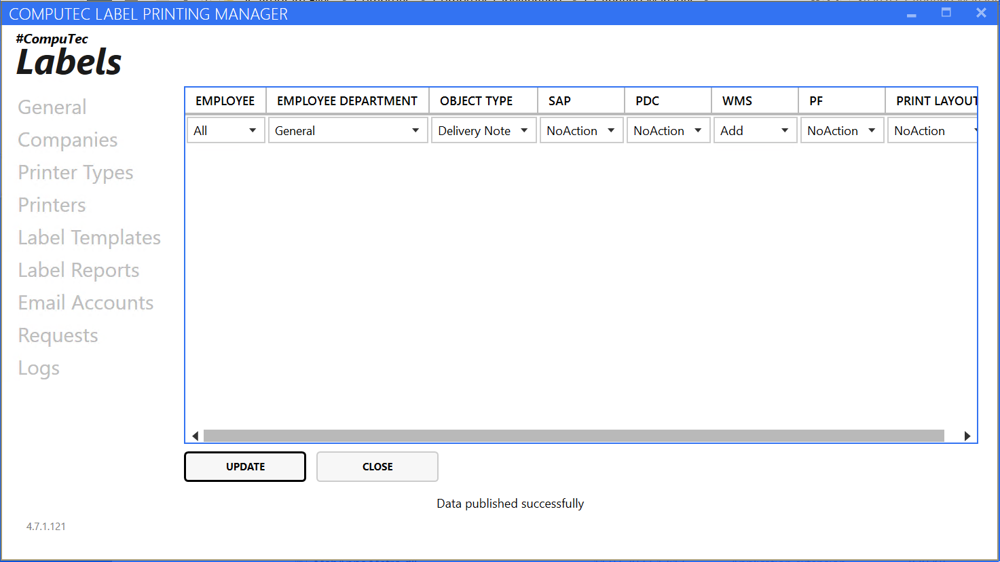

# Company Installation and Configuration

On this page, you can find detailed information on actions required to be taken concerning the Company.

---

To start working with CompuTec Labels on a specific company, the application database objects must be installed on a specified database. This will cause the installation of tables to the database in which all the CompuTec Labels related information will be stored. To do this, select a company row, right-click, and press Install/Update. SAP Business One user credentials have to be filled in to continue. The status bar below will indicate when the operation is done with a message.



Upon successful completion, it is necessary to activate the database (please check the context menu on the screenshot above, context menu). Please click Refresh and Update after this.

Now, the application is ready to configure settings for the specific company.

With a right click, we may then navigate to Printing Rules, Mapping Parameters, Event Triggers, Report Rules, and Settings View.

:::note

Note that to change any of the settings, you have to enter database credentials (username and password)

:::

## Settings View



Here, you can check a list of Object that can be chosen for Transaction. If you want to add new objects to the list for your CompuTec Labels installation, please contact CompuTec Support (support.computec.pl).

In the Specific Settings tab, you can enable Usage of Storage Procedures:

This option allows finding templates that are not defined in printing rules. This can be useful when we want to implement custom logic in finding templates. The procedure name for dealing with this is:

```
CT_LP_SELECTPRINTTEMPLATES
```

Please note that the template code returned by this procedure has to match the TEMPLATENAME defined on the label templates tab.

## Printing Rules View



In this view, we define new printing rules. The printing rule defines an action in which printing occurs.

Rules are grouped first by the requester and then by the transaction.

To define a new rule, right-click on the table and choose Add new rule.

Requester – an application from which printing requests come. It can be SAP, WMS, or PDC.

Transaction – transaction on which a specific print occurs. By default, the following transactions are available: Delivery Note, Goods Receipt PO, Stock Transfer, Stock Transfer Request, Goods Return, Return, Item Master Data, Additional Batch Details, Storage Unit, Goods Issue, DraftGRPO.

Click here to find out more about the Object list.

Document – here, you can define whether the rule concerns all of the documents in the chosen transaction or just one (in this case, you must specify its document number).

Employee – The employee is defined in SAP B1 for whom this printing rule works. You can set up a specific one or all.

User – SAP B1 for whom this printing rule works. You can set up a specific one or all.

Item Group – you can choose a specific one or all.

Card Group – Business Partner type of a specific document. You can choose either Customers or Suppliers.

Branch – if the company has branches, you can choose for which one the printing rule applies

WHSCode – code of a Warehouse for which the rule works

Unit of Measure

Header

Ignore All Others

Template – a template assigned for a specific printing rule.

## Mapping Parameters View

Here, you can define mapping parameters: what data is assigned to a specific variable from a label layout. A mapping scheme is defined in a particular template. Specific fields on a printing template will be filled with data assigned to parameters.



In this view, we provide parameter mappings for each template.

Choose a template from the drop-down list.

Then right-click and insert a new parameter. In the first column, please pick a parameter of interest, which will be mapped later.

In the second column select a parameter select – Parameter or SQL.

On setting up Type to Parameter, you can choose the following values:

 - Item Code

 - Quantity

 - Supplier/Customer Code

 - Start From

 - BarCode

 - Item Name

Choosing the SQL option means that you have to put in SQL or HANA queries to get a specific parameter from the database.

An Example of parameters used in a template and a final label based on it:



Click Update to save changes.

## Event Triggers View

<!--  -->

In this view, we define the action of which Employee printing will proceed.

These rules are called event triggers. To add a new one, right-click on the table and choose Add. Choose for which employee from which department the rule will be valid (you can choose All for both values). Choose the Object Type for which the rule is set. In columns SAP, PDC, WMS, and PF, you can choose an action for a specific application with which CompuTec Labels is connected. You can choose the following actions:

 - OnChange – printing starts on the update of a document

 - Add – printing starts with the addition of a document

 - NoAction – no action is taken automatically; you have to choose the right option from the application to start printing

Click Update to save changes.

:::note

Note: Event Triggers are considered in CompuTec products: SAP CompuTec Labels add-on, CompuTec WMS, CompuTec PDC, and ProcessForce. You can print only from objects defined in this table in these products.

:::
