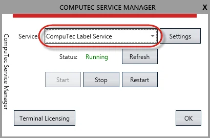
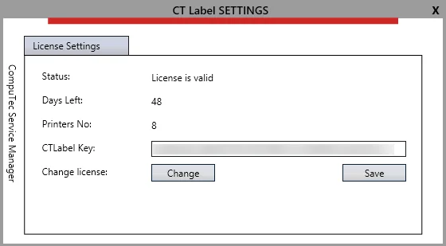
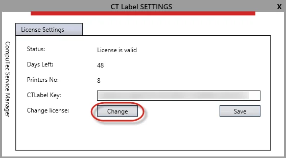
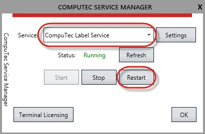
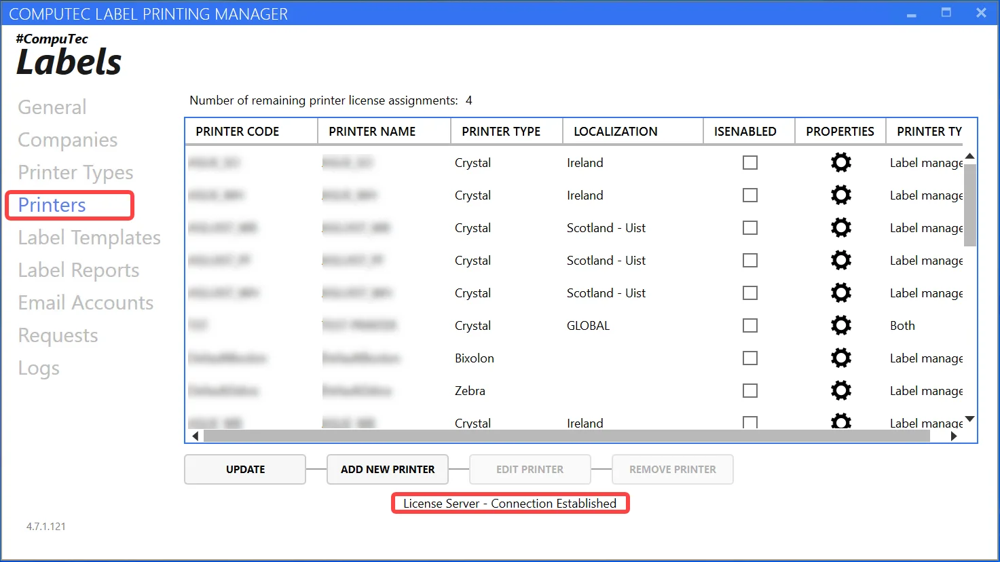
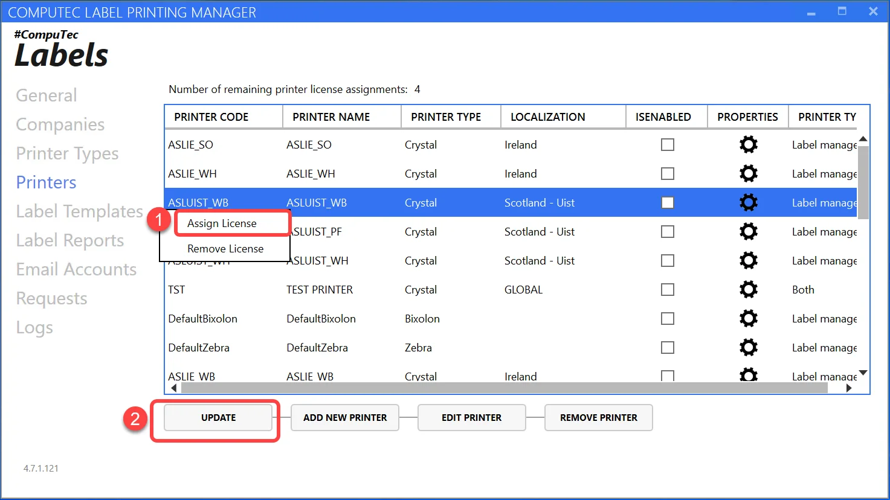

# Licensing

Here, you can find a description of a licensing process required for the legal working of CompuTec Labels.

---

## CompuTec Service Manager

CompuTec License Server is required in version 5.5 or above to work with CompuTec Labels. You can download it from here<!-- TODO: Link -->.

Run the installation file. When the installation is complete, run CompuTec Service Manager and choose CompuTec Label Service from a drop-down list:

:::note
    CompuTec Service Manager is a tool available within CompuTec License Server.
:::

Choose Settings. The following form will be displayed:

To obtain a license file, please send the following information to CompuTec Support:

1. CompuTec Labels Key – a number from CTLabel Keys from a screenshot above.

    :::note
        To make the support procedure easier, please copy the from the field (do not send a screenshot)
    :::
2. Number of required printer licenses (for partner's demo/test purposes: 1 printer license; for client's production system: a number of licenses bought for a client).

The license file obtained from CompuTec support is a .xml file.

## License assignment

### Main license assignment

License file assignment is done through Settings in CompuTec Service Manager.

On CT Labels Settings form, click Change and browse to the license file path (the license file obtained from CompuTec Support):

After license import, CompuTec License Server and CompuTec Label Service restart is required – you can do that with the button highlighted on the screenshot below:

### Printer license assignment

Go to CompuTec Label Printing Manager > Printers. You get a message indicating whether we have a connection with the license server or not.

If the license is correct, on the top, you can see the remaining number of available printer license assignments (in the example above, there are two printer licenses – you can see it on the screenshot in the main license assignment section – and two are already assigned to printers). To add a license to a printer – right-click on one and click Assign a license. Then Update.

