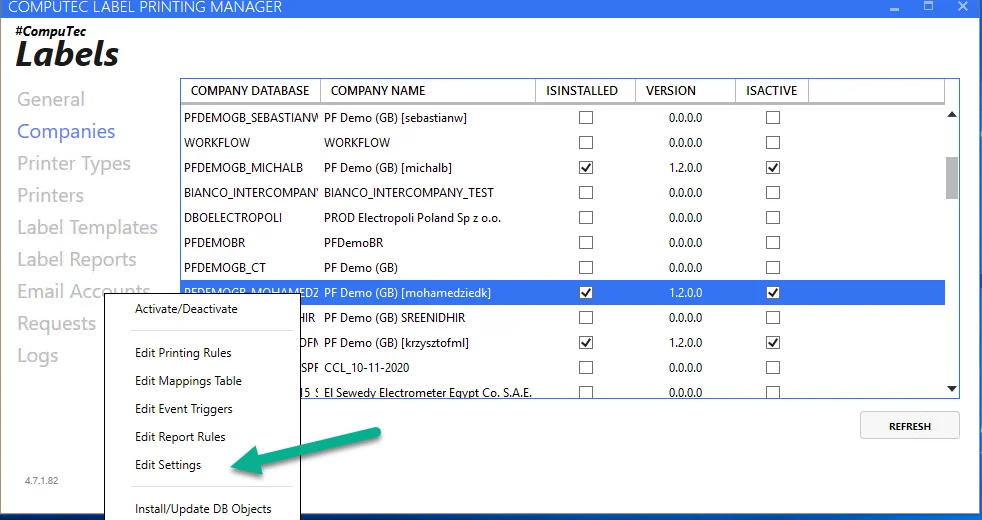
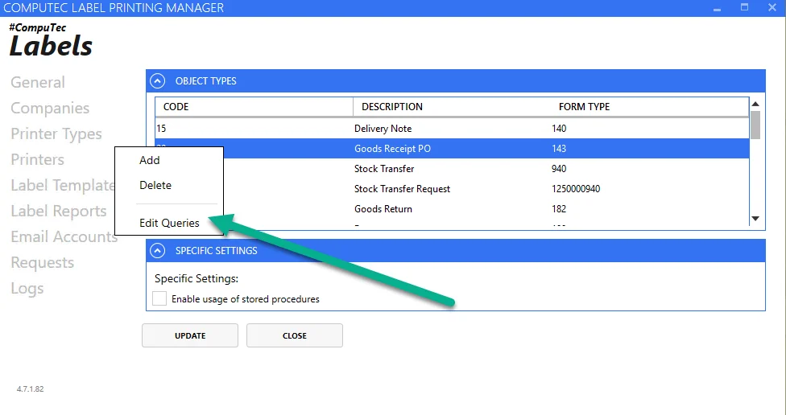
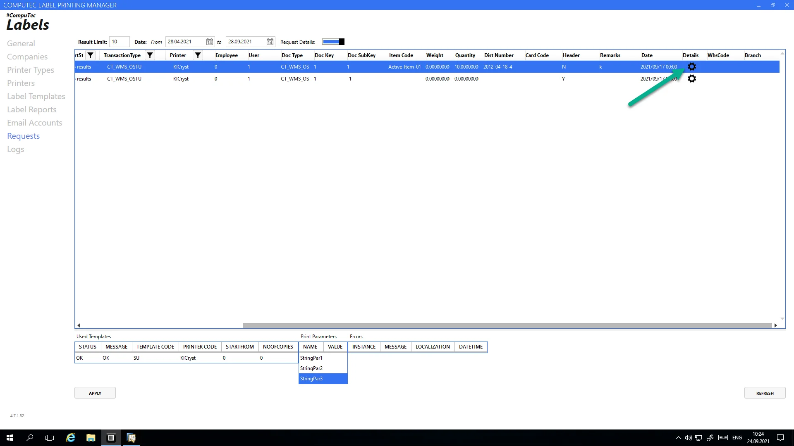
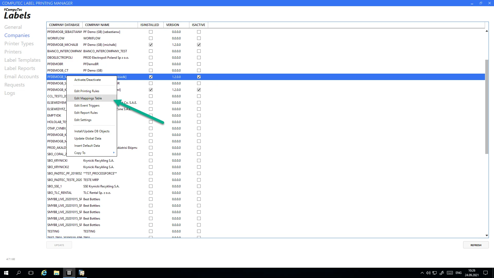
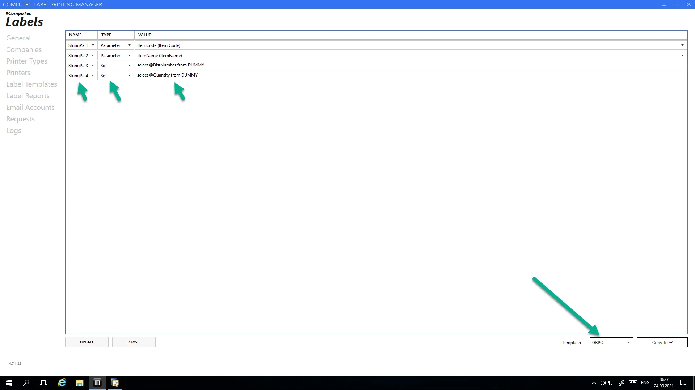
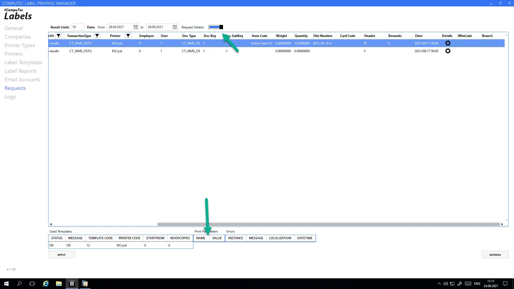

# Gathering more information from database to Label

There are two ways to get more information into the label from the database: using attributes and using query parameters. You can use one or the other or mix them.

---

## Using Attributes

Attributes are the additional columns that are gathered by the application when sending the print request from the device (ProcessForce, CompuTec WMS, SAP Business One, etc.). These pieces of information are calculated before the print request is sent to the Label Manager.

Each document type that is configured in Label Manager has embedded two queries that are responsible for preparing printing requests. Each row in the result of that query is then sanded to CT Label for additional service. The user can change those queries to manipulate label data and numbers. To find those queries, please go to:



Select the document you want to expand with new information and press the edit Queries option:



You can see two tabs on the screen that contains add and update query.

Add query is executed when the document is added to the system.

An update query is executed when the document is updated in the system.

:::warning

We recommend adding this new column in both queries.

:::

```sql
select  CURRENT_SCHEMA "CompanyDatabase" ,'Printer' "Printer",'20' "TransactionType",'SAP' "Requester",
        t0."UserSign" "EmpID",t0."UserSign" "UserSign",'20' "DocumentType"
        ,t0."DocEntry" "DocumentKey",-1 "DocumentSubKey",'' "ItemCode",0 "Weight", '' "DistNumber",t0."CardCode" "CardCode",
        'Y' "Header" ,0 "Quantity", '' "UoM"
        from OPDN t0
        where t0."DocEntry"=@list_of_cols_val_tab_del
        union all
        select CURRENT_SCHEMA "CompanyDatabase" ,'Printer' "Printer",'20' "TransactionType",'SAP' "Requester",
        t0."UserSign" "EmpID",t0."UserSign" "UserSign",'20' "DocumentType"
        ,t0."DocEntry" "DocumentKey",t1."LineNum" "DocumentSubKey",t1."ItemCode" "ItemCode",t1."Weight1" "Weight",
        IFNULL(t5."DistNumber", IFNULL(t4."DistNumber",''))"DistNumber",t0."CardCode" "CardCode",
        'N' "Header" ,abs(IFNULL(t3."Quantity",t1."InvQty") )"Quantity", t6."InvntryUom" "UoM"
        from OPDN t0
        inner join PDN1 t1 on t0."DocEntry"=T1."DocEntry"
        inner join oitm t6 on t1."ItemCode"=t6."ItemCode"
        left outer join oitl t2 on t0."DocEntry"=t2."DocEntry" and t1."LineNum"=t2."DocLine" and t2."DocType"='20'
        left outer join itl1 t3 on t2."LogEntry"=t3."LogEntry"
        left outer join obtn t4 on t3."ItemCode"=t4."ItemCode" and t3."SysNumber"=t4."SysNumber" and t2."ManagedBy"=10000044
        left outer join osrn t5 on t3."ItemCode"=t5."ItemCode" and t3."SysNumber"=t5."SysNumber" and t2."ManagedBy"=10000045
        where t0."DocEntry"=@list_of_cols_val_tab_del
```

The above query is a concatenation of two queries. The first one is responsible for sending the information to the CompuTec Labels about the header and the second for rows.

In the example below, the system creates a label request for the header object and each Batch and Serial number separately. By changing these queries, you can manipulate the number of requests sent to the Printer.

### Adding a new column to the query will give us the data in the label attributes

In this example, we will add the example text to a new column:

```sql
'This is my custom information for item '|| 't1."ItemCode" "MyCustomInfo"
```

```sql
select  CURRENT_SCHEMA "CompanyDatabase" ,'Printer' "Printer",'20' "TransactionType",'SAP' "Requester",
        t0."UserSign" "EmpID",t0."UserSign" "UserSign",'20' "DocumentType"
        ,t0."DocEntry" "DocumentKey",-1 "DocumentSubKey",'' "ItemCode",0 "Weight", '' "DistNumber",t0."CardCode" "CardCode",
        'Y' "Header" ,0 "Quantity", '' "UoM",'This is my custom information for header '  "MyCustomInfo"
    from OPDN t0
    where t0."DocEntry"=@list_of_cols_val_tab_del
    union all
select CURRENT_SCHEMA "CompanyDatabase" ,'Printer' "Printer",'20' "TransactionType",'SAP' "Requester",
        t0."UserSign" "EmpID",t0."UserSign" "UserSign",'20' "DocumentType"
        ,t0."DocEntry" "DocumentKey",t1."LineNum" "DocumentSubKey",t1."ItemCode" "ItemCode",t1."Weight1" "Weight",
        IFNULL(t5."DistNumber", IFNULL(t4."DistNumber",''))"DistNumber",t0."CardCode" "CardCode",
        'N' "Header" ,abs(IFNULL(t3."Quantity",t1."InvQty") )"Quantity", t6."InvntryUom" "UoM" 'This is my custom information for item '|| 't1."ItemCode" "MyCustomInfo"
    from OPDN t0
    inner join PDN1 t1 on t0."DocEntry"=T1."DocEntry"
    inner join oitm t6 on t1."ItemCode"=t6."ItemCode"
    left outer join oitl t2 on t0."DocEntry"=t2."DocEntry" and t1."LineNum"=t2."DocLine" and t2."DocType"='20'
    left outer join itl1 t3 on t2."LogEntry"=t3."LogEntry"
    left outer join obtn t4 on t3."ItemCode"=t4."ItemCode" and t3."SysNumber"=t4."SysNumber" and t2."ManagedBy"=10000044
    left outer join osrn t5 on t3."ItemCode"=t5."ItemCode" and t3."SysNumber"=t5."SysNumber" and t2."ManagedBy"=10000045
    where t0."DocEntry"=@list_of_cols_val_tab_del
```

### View the attributes

You can see all calculated Attributes of specific requests just by selecting Detail Information on the requests screen.



## Using Query Parameters

Query parameters are executed by the label manager when preparing a set of information to be transferred to the printer driver.

The Query parameters are specified in the Mappings table settings.



Please select a template for which you want to map the query to the output parameter.



### Possible Parameters

In the Type column, you have two options to choose from:

**Parameter** – hardcoded values

**SQL** – custom queries.

In the Value column for SQL type, you must enter the query that is executed to obtain the value, then pass it to the print parameter.

Input parameters for the custom query have a prefix of @

Example:

- @TransactionType

- @DocumentKey

- @MyCustomInfo

The list of the input parameters is a column in the template query from point no. 1.

### View of results of the query

The calculated values for custom queries are in the request details.


