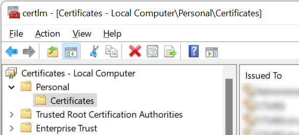
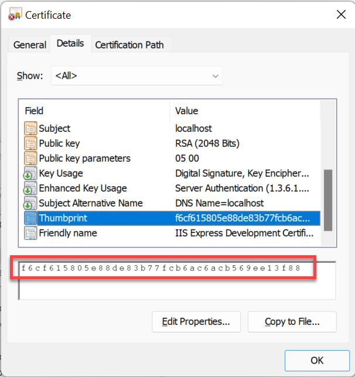

# HTTPS Configuration

Here, you can find information on configuring CompuTec Labels for HTTPS communication.

---

## Overview

To configure HTTPS, it must import a valid certificate to the Local Machine store on the server where the CompuTec Labels service runs and configure its properties in the CompuTec Labels configuration file.

## Certificate

Import a certificate used in the HTTPS communication to the Local Machine store on the Windows machine where the CompuTec Labels service will run. You can start the Local Machine certificate console with the command: `certlm.msc`.

The certificate must be placed in the Personal → Certificates store:



After importing, copy its Thumbprint property from the certificate Details tab, as it must be entered into the configuration file:



## Configuration

CompuTec Labels port and certificate thumbprint are defined in the configuration file located at `C:\Program Files\CompuTec\CompuTec LabelPrinting\CompuTec.LabelPrinting.WinService.exe.config`.

Open it in a text editor (e.g., Notepad) running as an Administrator so you can save it. Otherwise, you must copy it from this folder to another location where the user can write and copy files back after editing.

In the `<configuration> → <appsettings>` section define two keys:

- **portSSL** with the port on which the HTTPS endpoint will run,

- **portSSLCertThumbprint** with the thumbprint copied from the certificate.

Here is an example of the configuration:

```xml
<?xml version="1.0" encoding="utf-8"?>
<configuration>
  <appSettings>
    ...
    <add key="portSSL" value="55001" />
    <add key="portSSLCertThumbprint" value="f6cf615805e88de83b77fcb6ac6acb569ee13f88" />
    ...
  </appSettings>
  <startup>
  ...
  
```

After making this change in the configuration file, restart the CompuTec Label Service.

## How to check if the configuration works

You can open this URL in a web browser and see if it returns defined printers in CompuTec Labels in JSON format:

`https://<your_server>:<your_port_from_the_configuration_file>/API/LabelPrint/GetLicensedPrinters`
