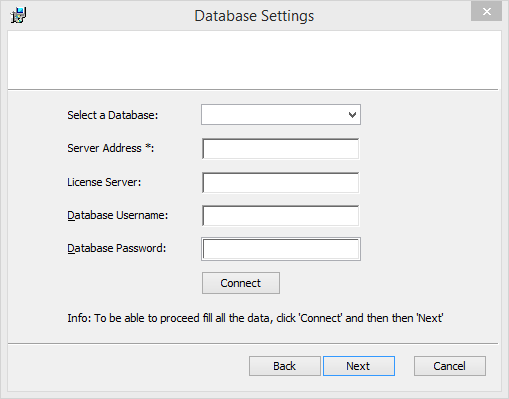
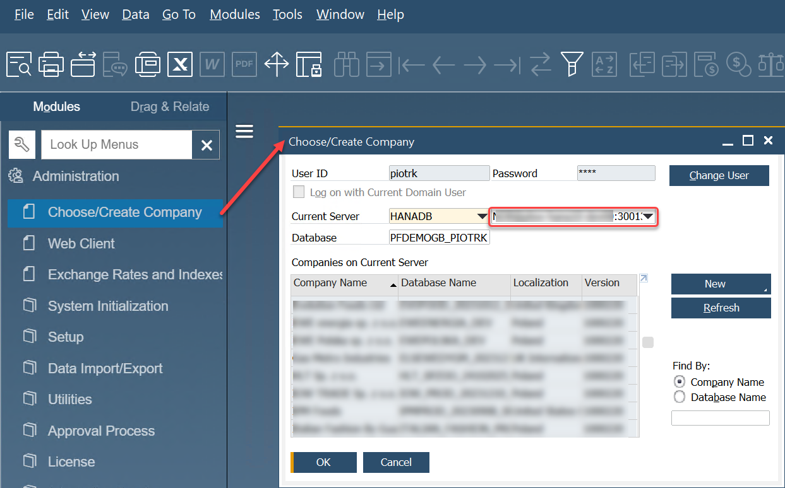
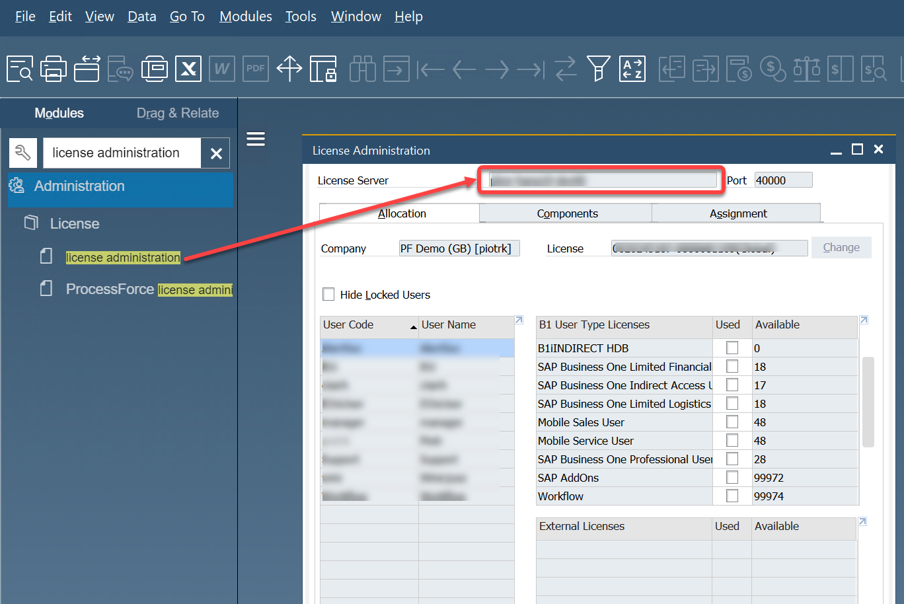
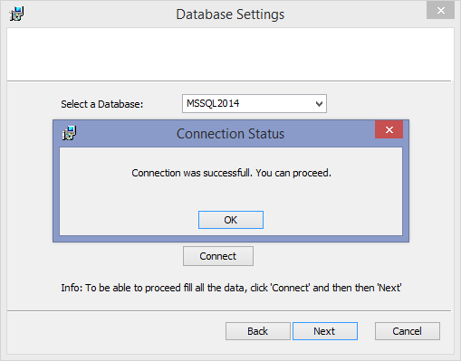

# Installation

On this page, you can find instructions on installing the application.

:::warning

Please check the [Requirements](./requirements.md) section before proceeding with the installation.

:::

---

1. Download the installation file from the Download section and run it. Choose the installation path.

2. During Installation, you are prompted with a window to establish a database connection with either SQL or SAP HANA (combo box pick).

    

3. Type in Server Address (on SAP HANA, you have to provide a port on par with the server address).

    You can copy the server name from SAP Business One installation:

    

4. SAP License Server Address (on SAP HANA, you have to provide a port on par with the server address)

    

5. And database credentials (you may require administrator support to fill this).
Click the Connect button. The following steps of the installation will be possible if the connection is valid.

6. Click the Connect button. The following steps of the installation will be possible if the connection is valid.

    

7. Upon completion, a new Windows Service (CTLabel Service) is added, as well as a new database (CTLabel) and a manager application (with desktop shortcut).
