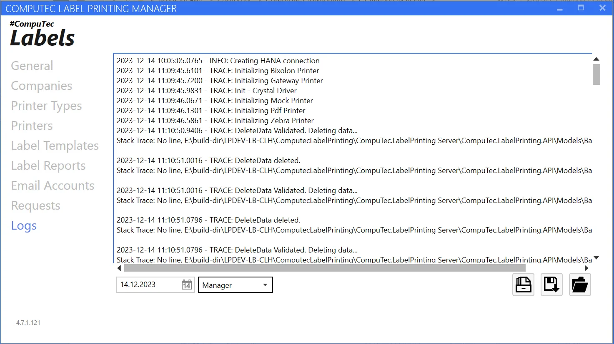
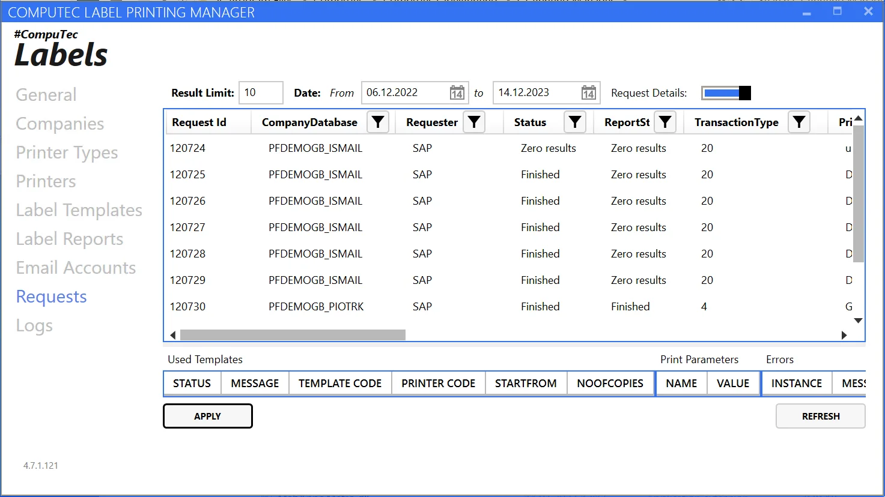
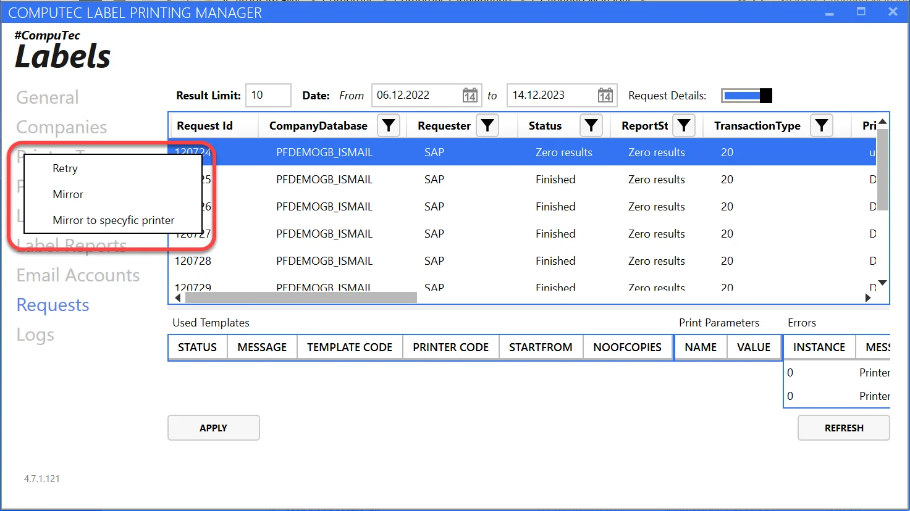
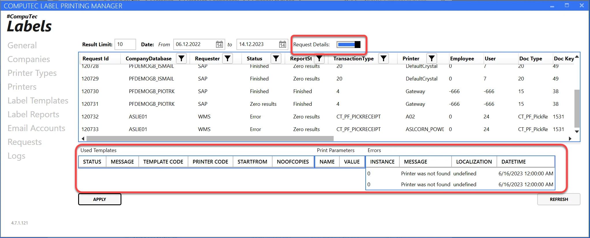

# Other Functions

You can find information about two utilities indirectly connected to the application on this page.

---

## Logs Tab

A log viewer – in the options below, we pick a date and a logging source (service, installation, manager). On the right, we have options for quick export to file.

## Requests Tab

Viewing requests from CT_LP_Requests. The view allows us to filter database requests by date with a maximum count of 100. You can filter the list by company, requester, status, transaction type, and printer.

Right Click enables more options – you can send a request again (a new one is created) or attempt to rerun the exact request (status changes to C).

Additionally, there is an option to show request details – its parameters, information, and errors by dragging the upper strip to the right-hand side.

