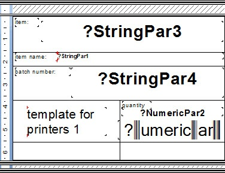
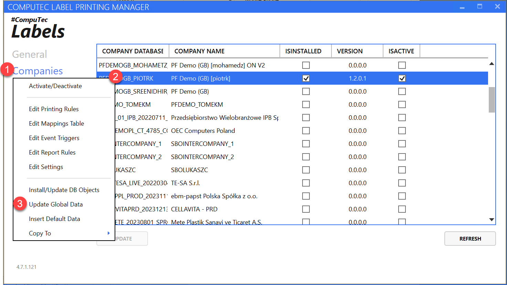
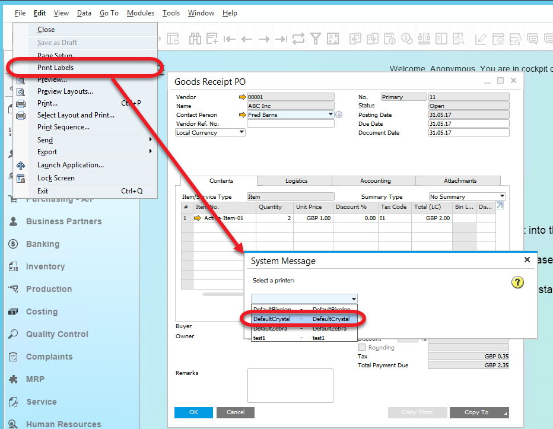
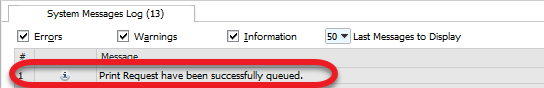

# Scenario 1: Goods Receipt PO printed from SAP Business One

In this step-by-step manual, we will manually configure the application to print Goods Receipt PO from SAP Business One. Additionally, we want to save the prints to PDF.

---

## Printer settings

Only the Crystal printer type allows to save to PDF. Therefore, we will use this option in this scenario.

We will use the following printer configuration:

 - Printer Code: test1

 - Printer Type: Crystal

 - Printer Name: test1

 - Localization: CT

With the following parameters, define

 - SaveAsPdf: True

 - PhysicalName: Send to OneNote 16 (one of the printer's names available on this test server)

 - MaxCapacity: 75.

## Label Template

We have to create a Label Template to which settings will be assigned and which itself will be assigned to a specific printer.

A Label Template used in this scenario:

| TEMPLATE CODE | TEMPLATE NAME | TEMPLATE DESCRIPTION |
|:-------------:|:-------------:|:--------------------:|
| GRPO          | GRPO          | GRPO                 |
|               |               |                      |

## Printing Rules

Requester: SAP

Transaction: Goods Receipt PO

Employee/User/ItemGroup/Warehouse: All

Unit of Measurement – not checked

Header – not checked

Template: GRPO

## Label Report

### Crystal Report

Crystal report used in this scenario:

In Crystal Reports, different variables are used, e.g., StringPar, and NumericPar. It is possible to attach to each of its specific data in the next step: mapping.

### CompuTec Labels localization

Crystal reports used by CompuTec Labels have to be located in the following locations:

C:\ProgramData\CompuTec\CT Label Printing\Reports\

(or the corresponding installation directory if the default one was not chosen).

## Mapping

Next, we must define mapping parameters: what data is assigned to a specific variable from a label layout.

Mapping rules used in this scenario:

|    Name    |    Type   |             Value             |
|:----------:|:---------:|:-----------------------------:|
| StringPar3 | Parameter | Item Code (Item Code)         |
| StringPar1 | Parameter | ItemName (ItemName)           |
| StringPar4 | Sql       | SELECT @DistNumber FROM DUMMY |

## Event Triggers

The next thing is to define what action printing will occur.

Event Triggers set up used in this scenario:

| Employee | Employee Department |    Object Type   |    SAP   |    PDC   |    WMS   |    PF    |
|:--------:|:-------------------:|:----------------:|:--------:|:--------:|:--------:|:--------:|
| All      | All                 | Goods Receipt PO | OnChange | NoAction | NoAction | NoAction |

## Data Update

After setting up all the settings, go to Companies and choose Update Global Data option:

## Template assigning

Next, we have to assign the template, GRPO, in this case, to a specific printer and choose the following:

| INFO |    NAME   | TEMPLATE CODE | PRINTER CODE |                                               FILE                                              |
|:----:|:---------:|:-------------:|:------------:|:-----------------------------------------------------------------------------------------------:|
| OK   | GRPOtest1 | GRPO          | test1        | C:\Program Files (x86)\CompuTec\CompuTec LabelPrinting\Reports\LabelPrintingAyCrystalLayout.rpt |

## Printing

We defined the printing trigger as OnChange, which means that, in our case, a printing occurs on an updating a Goods Receipt PO document.

We can also print a label manually at any time. To do this in SAP B1, go to the upper menu > File > Print Labels. Choose Crystal printer from a drop-down list and click Print.

A system message will appear:

