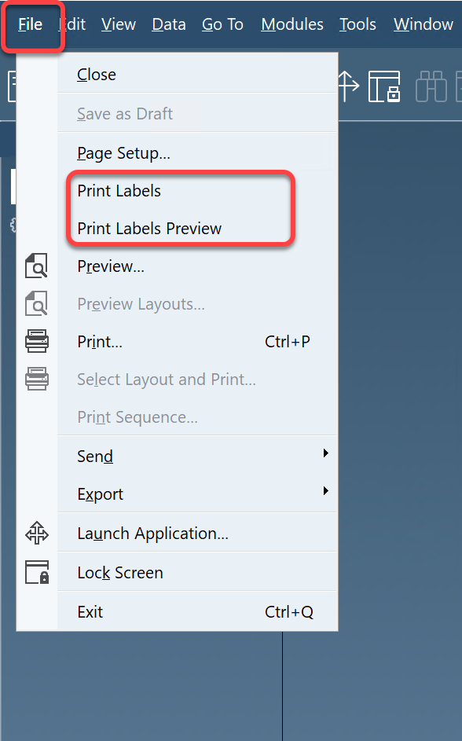
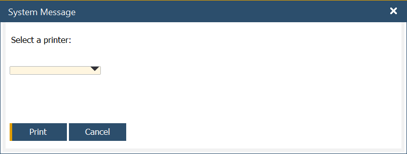
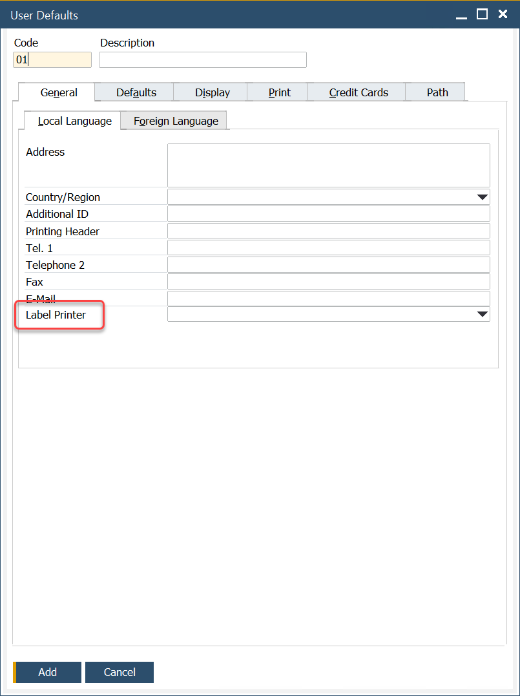
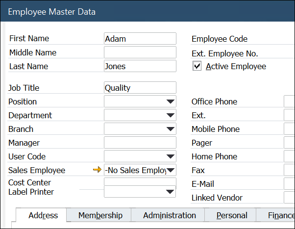

# SAP Add-on

:::info

To proceed with the following instructions, the SAP add-on has to be installed. Click [here](../../setup/computec-labels-sap-addon.md) to check how to do this.

:::

To be able to print, first, you have to define object types that will be marked for this action. You can check here how to do this. These are the only objects on that view that can trigger a print action.

Summarizing, all objects checked as 'Add' in the event triggers view (CT_LP_ETRG table) in column SAP will print automatically on add an action (provided employee has access to it (see events triggers view))

All objects checked as 'OnChange' in the event triggers view (CT_LP_ETRG table) in column SAP will print automatically on add/update action (provided the employee has access to it (see events triggers view)).

All objects regardless of an action in the event triggers view (CT_LP_ETRG table), will be accessible for manual printing in the SAP add-on.

## Manual printing

To print on your request, open a document (object type has been defined) you wish to print. Navigate to File > Print Labels.

New windows appear. From there, just select a printer and click Print:

## Default printers for autonomic printing

For automatic printing (add/update printing as mentioned above), you must set up a default printer for the user/employee.

To do that, choose SAP B1: Administration > Setup > General > User Defaults > General tab. There is an option to select a printer.

Then, assign the user code to match that code from the users_default page.

Employee Master Data

